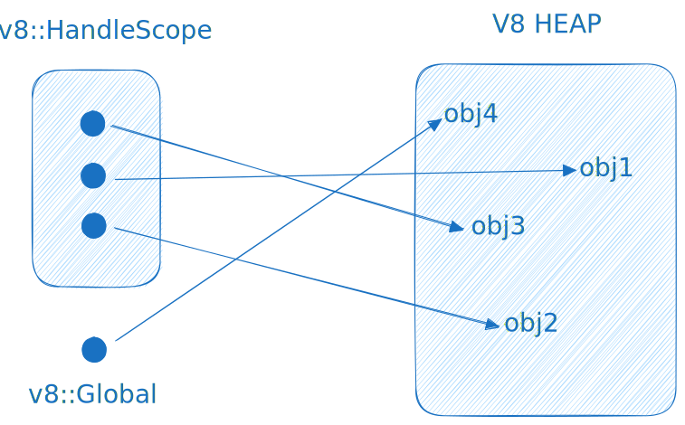

# The Runtime

Hi! 👋 You've found the technical overview of Dune as a JavaScript runtime. This README aims to help you understand the inner workings of the runtime and the reason behind some architectural decisions.

### V8 Engine

Dune harnesses the immense capabilities of the [V8](https://v8.dev/) engine through the utilization of the [rusty_v8](https://github.com/denoland/rusty_v8) crate, a remarkable creation by the talented Deno team. Serving as a convenient wrapper for V8's C++ APIs, this crate allows seamless communication with V8, ensuring alignment with the original API to a high degree.

<br/>
<center></center>
<br/><br/>

All rusty_v8's available APIs can be found [here](https://docs.rs/v8/latest/v8/).

The purpose of this README is not to comprehensively cover all V8 concepts. However, we will touch on some key ones to enhance understanding in this technical overview. Among these concepts are the [Isolate](#isolate) and JS [Handlers](#handles).

#### `Isolate`

The `v8::Isolate` is like a little world inside the JavaScript engine. Imagine it as a container that holds all the JavaScript objects, known as the **"heap."** These objects can interact with each other, and the isolate manages this interaction.

In the world of the `v8::Isolate`, there are special tools to control how things work. For example, they can be used to check how much memory the engine is using, or to clean up unnecessary objects (a process known as garbage collection) to keep the engine running efficiently.

Each `v8::Isolate` operates independently. It means that if something needs to be cleaned up, it only affects that specific world, not the entire engine. Think of it like having separate rooms in a house – cleaning up one room doesn't impact the others. This isolation is important because it keeps different parts of a program from accidentally affecting each other, ensuring that everything works as intended.

#### `Handles`

Every object generated by V8 must be monitored by the garbage collector to confirm its continued existence. Since the garbage collector can relocate objects, directly referencing an object is risky. To mitigate this, all objects are stored in handles, which are recognized by the garbage collector and adjusted whenever an object is relocated.

<br/>
<center></center>
<br/><br/>

There are two types of handles: <u>local</u> and <u>persistent</u> handles.

A `v8::Local` handle serves as a **momentary** pointer to a JavaScript object, typically becoming obsolete once the current function completes its execution. These handles are under the management of `HandleScopes`. This implies that a HandleScope must be present on the stack at the time of their creation, and they remain valid only within the active HandleScope during their instantiation.

Most of the V8 API uses Local handles to work with JavaScript values or return them from functions.

The following JavaScript and Rust code are mostly equivalent:

```js
function getFoo(obj) {
  return obj.foo;
}
```

```rust
fn getFoo(
    scope: &mut v8::HandleScope,
    args: v8::FunctionCallbackArguments,
    mut rv: v8::ReturnValue,
) {
    let object = v8::Local::<v8::Object>::try_from(args.get(0)).unwrap();
    let field = v8::String::new(scope, "foo").unwrap();
    let foo = object.get(scope, field.into()).unwrap();
    rv.set(foo.into());
}
```

A `v8::Global` handle is a lasting reference that allows objects to be stored across multiple independent operations. It must be explicitly deallocated when it's no longer needed.

Due to their persistent nature, these handles are considered to have a lifetime equivalent to `'static`.

```rust
let number_1 = v8::Integer::new(scope, 1);
let number_1_global = v8::Global::new(scope, number_1);
```

It is safe to extract the object stored in the handle by dereferencing the handle (for instance, to extract the \*Object from a Local); the value will still be governed by a handle behind the scenes and the same rules apply to these values as to their handles.

#### `HandleScopes`

Certainly, generating a local handle for every object creation can lead to an abundance of handles. Handle scopes prove immensely valuable in managing this situation. onsider a handle scope as a container that accommodates multiple handles. Once the handle scope is no longer active, all handles created within that scope are removed from the stack.

As a natural consequence, the objects indicated by these handles become eligible for deletion from the heap by the garbage collector.

<br/>
<center></center>
<br/><br/>

For more in-depth information about isolates, handles, etc. visit v8's advanced [guide](https://v8.dev/docs/embed#advanced-guide).

### Architecture

Dune is composed of mainly 2 separate parts:

<center></center>

#### `JavaScript Frontend`

Public interfaces, APIs and important functionalities that do not directly require sys-calls are implemented here.

JavaScript operates in a limited environment without direct access to files or networks. It's confined within V8's secure space. To access files and networks, the frontend uses what we call `bindings` to connect with the more powerful Rust backend.

In simpler terms, many Dune APIs, especially those dealing with files, work by transforming data on the JavaScript side. This transformed data is sent to the Rust backend using the bindings interface. Then, JavaScript waits for the result to be sent back, whether it happens immediately or after a delay (asynchronously).

#### `Rust Backend`

The powerful part of the system, called the "privileged side," which can access files, networks, and the environment, is created using **Rust**.

For those who are not familiar with the language, Rust is a systems programming language developed by Mozilla, focusing on memory and concurrency safeties. It is also used in projects like [Deno](https://deno.com/), [SurrealDB](https://surrealdb.com/), etc.

### Bindings

As mentioned earlier, bindings serve as the **link** connecting the JavaScript frontend and the Rust backend. These bindings essentially consist of Rust functions that are initialized during the system's startup process and then become accessible to the JavaScript side.

These bindings are organized into **namespaces**. In practical terms, this means that JavaScript can request specific Rust functions from designated namespaces like `stdio` or `net`. Each namespace contains functions tailored to perform specific actions within its designated scope.

**Example: How console.log actually works?**

To grasp this process, let's examine how something passed to `console.log` ultimately appears in our terminal.

```js
// File: /src/js/console.js

/**
 * Outputs data to the stdout stream.
 *
 * @param  {...any} args
 */

log(...args) {
  const output = args.map((arg) => stringify(arg)).join(' ');
  process.stdout.write(`${output}\n`);
}
```

The provided code snippet belongs to the **console** module. It takes multiple arguments, transforms each argument into a string (including formatting JavaScript values), and then passes the result to `process.stdout.write`.

Let's take a look how the `process.stdout.write` is implemented.

```js
// File: /src/js/main.js

Object.defineProperty(process, 'stdout', {
  get() {
    return {
      write: process.binding('stdio').write,
      end() {},
    };
  },
  configurable: true,
});
```

Let's break it down:

1. **`Object.defineProperty(process, 'stdout', {...});`**: This line modifies the stdout property of the process object using the `Object.defineProperty` method. It configures how the stdout property is accessed and manipulated.

2. **`write: process.binding('stdio').write`**: This line sets the write property to the write method from the **stdio** namespace. In simpler terms, it means that when `process.stdout.write` is used, it triggers the `write` method from the `stdio` binding, controlling how output data is handled.

This approach is widespread in the code. Whenever we need to use a Rust function, we employ the `process.binding` method and specify the desired namespace.

**Let's dig into the Rust backend then** 👷‍♂️

```rust
// File: /src/stdio.rs

set_function_to(scope, target, "write", write);

/// Writes data to the stdout stream.
fn write(scope: &mut v8::HandleScope, args: v8::FunctionCallbackArguments, _: v8::ReturnValue) {
    // Convert string to bytes.
    let content = args.get(0).to_rust_string_lossy(scope);
    let content = content.as_bytes();
    // Flush bytes to stdout.
    io::stdout().write_all(content).unwrap();
    io::stdout().flush().unwrap();
}

```

This looks simple enough, even for Rust:

1. **`set_function_to(...)`**: This line is is setting a function named `write` under the **stdio** binding namespace.

2. **`args.get(0).to_rust_string_lossy(scope)`**: Retrieves the first argument passed JavaScript when the `write` function was called, converting it into a Rust string.

3. **`content.as_bytes()`**: The `content` string is then converted into a byte slice, which is necessary for writing to standard output.

4. **`io::stdout().write_all(content);`**: This line uses the Rust standard library `io::stdout()` to write the content byte slice to the **standard output**. `write_all` writes all the bytes at once.

The **standard output** (stdout) is the default file descriptor where a process can write output. In simpler terms, any program wanting to display information in the `terminal` must send that information to this output `stream`.

Certainly, that was the most basic example showcasing how bindings function in Dune. However, this process remains consistent in all cases. The only difference lies in the complexity of the code, which increases based on the required functionality.

### Repo Structure

In this section, we'll delve into the current structure of the Dune repository so you can navigate it comfortably.

Here is the link to the repo: https://github.com/aalykiot/dune

```
# DIRECTORIES
src/: Rust Backend
js/: JavaScript Frontend
tools/: Standalone commands
tests/: Functional tests
examples/: Useful dune use-cases
scripts/: Build scripts for some platforms

# FILES
Cargo.toml: Dependency info for Rust
package.json: Node dependencies (mostly repo metadata)
build.rs: Cargo build rules
```

#### src/

The Rust backend lives here.

1. **`main.rs`**: houses the primary Rust function. It serves as the real **starting** point when you execute the Duno binary.

2. **`runtime.rs`**: handles the logic for initializing the runtime, executing JavaScript code, and managing the event-loop execution.

3. **`event_loop.rs`**: contains all the event-loop code that is required by Dune.

4. **`loaders.rs`**: contains the logic necessary to resolve and load various imports, such as URLs and modules.

5. **`bindings.rs`**: exposes the defined `bindings` to the JavaScript frontend.

6. **`modules.rs`**: encompasses the logic related to ECMAScript module resolution.

7. **`errors.rs`**: houses logic responsible for converting V8 exceptions into custom Rust errors, along with associated metadata information.

8. **`repl.rs`**: contains all the logic around Dune's available read-eval-print-loop interface.

These represent the core components, with the remaining files primarily defining bindings within a designated namespace.

#### js/

This is where code for the JavaScript frontend is located. Most APIs are defined under a `namespace` known in the Node.js world as a `module`. For example, `readFile` is defined in the `fs.js`.

1. **`console.js`**: A subset of the WHATWG console.

2. **`fs.js`**: Equivalent to Node.js' `fs` core module.

3. **`net.js`**: Equivalent to Node.js' `net` core module.

4. **`http.js`**: Equivalent to Node.js' `http` core module.

5. etc.

#### tools/

Standalone commands that Dune's CLI provides.

1. **`bundle`**: Bundles everything into a single file.

2. **`compile`**: Compiles script to standalone executable.

3. **`upgrade`**: Upgrades to the latest dune version.

#### tests/

Functional tests for Dune.

Files with the extension `*.test.js` or `*.test.ts` contain the code executed for each test case. These tests are designed to verify the proper functioning of all Dune's APIs.

See the [testing](https://github.com/aalykiot/dune/tree/main#testing) section for more details.

#### build.rs

Defines `cargo build` logic. Internally makes the current bin `version` available.
