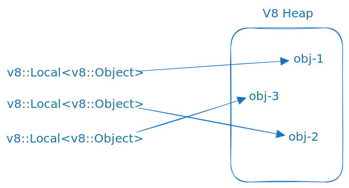
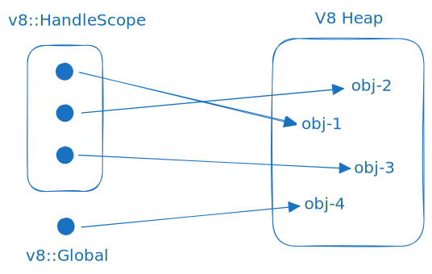
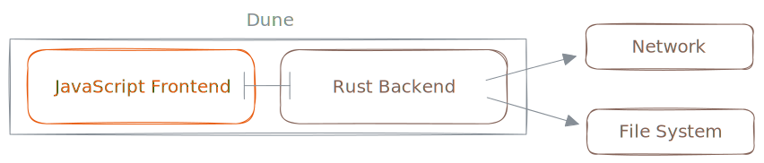
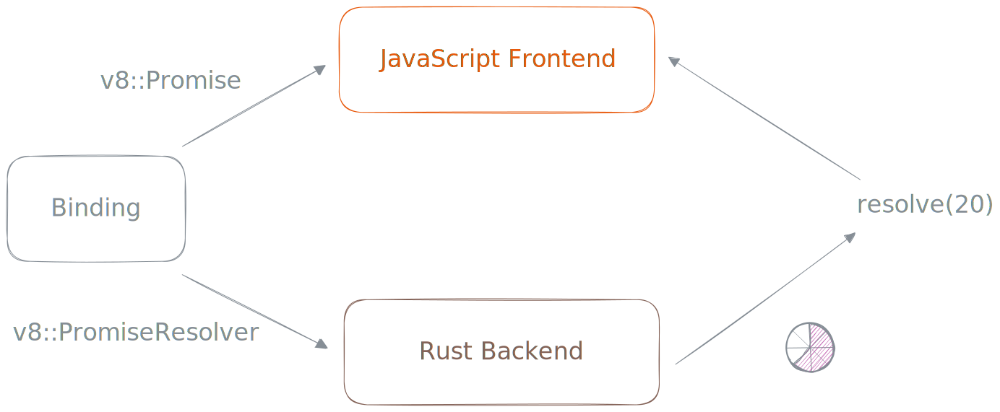

# Dune - The Runtime

Hi! 👋 You've found the technical overview of Dune as a JavaScript runtime. This README aims to help you understand the inner workings of the runtime and the reason behind some architectural decisions.

### V8 Engine

Dune leverages the powerful capabilities of the [V8](https://v8.dev/) engine through the usage of the [rusty_v8](https://github.com/denoland/rusty_v8) crate, an impressive creation by the skilled Deno team. Serving as a convenient wrapper for V8's C++ APIs, this crate allows seamless communication with V8, ensuring alignment with the original API to a high degree.

<br />

<br />

All available APIs of `rusty_v8` can be found in the official [documentation](https://docs.rs/v8/latest/v8/).

The purpose of this README is not to comprehensively cover all V8 concepts. However, we will touch on some key ones to enhance understanding in this technical overview. Among these concepts are the [Isolate](#isolate) and JS value [Handles](#handles).

#### `Isolate`

The `v8::Isolate` is like a little world inside the JavaScript engine. Imagine it as a container that holds all the JavaScript objects, known as the **"heap."** These objects can interact with each other, and the isolate manages this interaction.

In the world of the `v8::Isolate`, there are special tools to control how things work. For example, they can be used to check how much memory the engine is using, or to clean up unnecessary objects (a process known as garbage collection) to keep the engine running efficiently.

Each `v8::Isolate` operates independently. It means that if something needs to be cleaned up, it only affects that specific world, not the entire engine. Think of it like having separate rooms in a house – cleaning up one room doesn't impact the others. This isolation is important because it keeps different parts of a program from accidentally affecting each other, ensuring that everything works as intended.

#### `Handles`

Every object returned from V8 must be monitored by the garbage collector to confirm its active status. Directly pointing to an object is unsafe due to potential object movement during garbage collection. Consequently, all objects are stored in handles, recognized by the garbage collector and updated whenever an object relocates.

<br/>

<br/><br/>

There are two types of handles: **local** and **persistent** (global) handles.

A `v8::Local` handle serves as a momentary pointer to a JavaScript object, typically no longer required after the current function finishes execution. These handles are restricted to allocation on the Rust stack. Local handles are lightweight and short-lived, primarily employed in local operations.

They are supervised by [HandleScopes](#handlescopes), necessitating the presence of a `v8::HandleScope` on the stack during their creation. Furthermore, they remain valid only within the active HandleScope during their instantiation.

Most of the V8 API uses Local handles to work with JavaScript values or return them from functions.

The following JavaScript and Rust code are mostly equivalent:

```js
function getFoo(obj) {
  return obj.foo;
}
```

```rust
fn get_foo(
  scope: &mut v8::HandleScope,
  args: v8::FunctionCallbackArguments,
  mut rv: v8::ReturnValue,
) {
  let object = v8::Local::<v8::Object>::try_from(args.get(0)).unwrap();
  let field = v8::String::new(scope, "foo").unwrap();
  let foo = object.get(scope, field.into()).unwrap();
  rv.set(foo.into());
}
```

`v8::Global` handles are suitable for storing objects across multiple independent operations. It is crucial to explicitly deallocate them when they are no longer in use.

Because of their persistent nature, these handles are deemed to have a lifetime equivalent to `'static`.

```rust
let number_1 = v8::Integer::new(scope, 1);
let number_1_global = v8::Global::new(scope, number_1.into());
```

Safely extracting the object stored in the handle, such as retrieving `*Object` from a Local, can be done by dereferencing the handle. The value remains under the control of a handle behind the scenes, and the same rules governing handles are applicable to these values.

#### `HandleScopes`

Obviously, creating a local handle for every object can result in an excessive number of handles. The `v8::HandleScope` allocated on the stack, manages several local handles. Once a handle scope is established, all local handles are allocated within that scope. If a handle scope already exists and a new one is initiated, all allocations occur within the new handle scope until its deletion. After that, new handles will once more be allocated within the original handle scope.

Once the handle scope of a local handle is deleted, the garbage collector will cease tracking the object stored in the handle, and it might deallocate it.

<br/>

<br/>

For more in-depth information about isolates, handles, etc. visit v8's advanced [guide](https://v8.dev/docs/embed#advanced-guide).

### Architecture

Dune is composed of mainly 2 separate parts:



#### `JavaScript Frontend`

This part encompasses public interfaces, APIs, and crucial functionalities that operate without direct sys-calls.

JavaScript operates within the "unprivileged side", lacking default access to the file system or network due to its sandboxed environment in V8. For file and network access, the frontend relies on `bindings` to establish connections with the more "privileged" Rust backend.

In simpler terms, numerous Dune APIs, particularly those related to file system operations, are executed on the JavaScript side by primarily managing and converting data. These transformed data are then dispatched to the Rust backend via the `bindings` interface, with JavaScript subsequently awaiting the result to be returned, whether this occurs synchronously or asynchronously.

#### `Rust Backend`

The powerful part of the system, known as the "privileged side", possesses the capability to access files, networks, and the system environment, it is built using **Rust**.

For those unfamiliar with the language, Rust is a systems programming language developed by Mozilla, emphasizing memory safety and concurrency. It finds applications in projects such as [Deno](https://deno.com/) and [SurrealDB](https://surrealdb.com/), among others.

### Bindings

As previously explained, bindings act as the `bridge` linking the JavaScript frontend to the Rust backend. These bindings primarily consist of Rust functions that are initialized during the system's startup process and subsequently made accessible to the JavaScript side.

These bindings are structured into **namespaces**, which means that in practical terms, JavaScript can request specific Rust functions from designated namespaces such as `stdio` or `net`. Each namespace comprises functions customized to execute specific actions within its designated scope.

**Example: How console.log actually works?**

To understand this process, let's explore how something passed to `console.log` ultimately appears in our terminal.

```js
// File: /src/js/console.js
//
/**
 * Outputs data to the stdout stream.
 *
 * @param  {...any} args
 */
log(...args) {
  const output = args.map((arg) => stringify(arg)).join(' ');
  process.stdout.write(`${output}\n`);
}
```

The provided code snippet is part of the **console** module. It takes multiple arguments, transforms each argument into a string (which includes formatting JavaScript values), and then passes the resulting string to `process.stdout.write`.

Let's take a look how the `process.stdout.write` is implemented.

```js
// File: /src/js/process.js
//
const io = process.binding('stdio');

defineStream('stdout', () => ({
  write: io.write,
  end() {},
}));
```

Let's break it down:

1. **`defineStream('stdout', () => {...});`**: This line alters the stdout property of the process object using the `Object.defineProperty` method under the hood. It defines how the stdout property can be accessed and manipulated.

2. **`write: io.write`**: This line assigns the write property to the write method from the **stdio** namespace. In simpler terms, it means that when `process.stdout.write` is invoked, it calls the write method from the `stdio` binding, governing the handling of output data.

This approach is widespread throughout the codebase. Whenever we need to use a Rust function, we employ the `process.binding` method and specify the desired namespace.

**Let's dig into the Rust backend then** 👷‍♂️

```rust
// File: /src/stdio.rs
//
set_function_to(scope, target, "write", write);

/* .. more code .. */

/// Writes data to the stdout stream.
fn write(scope: &mut v8::HandleScope, args: v8::FunctionCallbackArguments, _: v8::ReturnValue) {
  // Convert string to bytes.
  let content = args.get(0).to_rust_string_lossy(scope);
  let content = content.as_bytes();
  // Flush bytes to stdout.
  io::stdout().write_all(content).unwrap();
  io::stdout().flush().unwrap();
}

```

This looks simple enough, even for Rust:

1. **`set_function_to(...)`**: This line is setting a function named `write` under the **stdio** binding namespace.

2. **`args.get(0).to_rust_string_lossy(scope)`**: Retrieves the initial argument passed from the JavaScript side when the `write` function was called. It then converts this argument into a Rust string.

3. **`content.as_bytes()`**: The `content` string is then converted into a byte slice, which is necessary for writing to standard output.

4. **`io::stdout().write_all(content);`**: This line uses the Rust standard library `io::stdout()` to write the content byte slice to the **standard output**. `write_all` writes all the bytes at once.

The **standard output** (stdout) is the default file descriptor where a process can write output. In simpler terms, any program wanting to display information in the `terminal` must send that information to this output `stream`.

Certainly, the provided example represents the fundamental workings of bindings in Dune. This process remains uniform across all scenarios. The variation lies in the complexity of the code, which escalates according to the required functionality.

### Runtime State

Every Dune process is linked to a specific `state` containing information related to a particular `v8::Isolate` instance. The state includes information about startup time, initialization options, ES-module metadata, various queues, and notably, a handle to the event-loop.

Whenever a new operation needs to be dispatched to the `event-loop`, such as a network call or file read, it is necessary to first obtain access to this state.

**The current runtime state:**

```rust
// File: /src/runtime.rs
//
pub struct JsRuntimeState {
  /// A sand-boxed execution context with its own set of built-in objects and functions.
  pub context: v8::Global<v8::Context>,
  /// Holds information about resolved ES modules.
  pub module_map: ModuleMap,
  /// A handle to the runtime's event-loop.
  pub handle: LoopHandle,
  /// A handle to the event-loop that can interrupt the poll-phase.
  pub interrupt_handle: LoopInterruptHandle,
  /// Holds JS pending futures scheduled by the event-loop.
  pub pending_futures: Vec<Box<dyn JsFuture>>,
  /// Indicates the start time of the process.
  pub startup_moment: Instant,
  /// Specifies the timestamp which the current process began in Unix time.
  pub time_origin: u128,
  /// Holds callbacks scheduled by nextTick.
  pub next_tick_queue: NextTickQueue,
  /// Stores and manages uncaught exceptions.
  pub exceptions: ExceptionState,
  /// Runtime options.
  pub options: JsRuntimeOptions,
  /// Tracks wake event for current loop iteration.
  pub wake_event_queued: bool,
  /// A structure responsible for providing inspector interface to the runtime.
  pub inspector: Option<Rc<RefCell<JsRuntimeInspector>>>,
}
```

> The above snippet might not be in sync with the current structure in the main branch. ☝️

To enable access to this state from various V8 structures, we store it within the isolate's `slot`.

```rust
let mut isolate = v8::Isolate::new(v8::CreateParams::default());
let state = Rc::new(RefCell::new(RuntimeState{..}));

// Store state inside the v8 isolate slot.
isolate.set_slot(state);
```

Anyone with access to a `v8::HandleScope` can obtain a reference to this state through a convenient `static` exposed utility from the JsRuntime struct:

```rust
impl JsRuntime {
  /// Returns the runtime state stored in the given isolate.
  pub fn state(isolate: &v8::Isolate) -> Rc<RefCell<JsRuntimeState>> {
    isolate
      .get_slot::<Rc<RefCell<JsRuntimeState>>>()
      .unwrap()
      .clone()
  }
}
```

The key point here is that Rust [automatically](https://docs.rs/v8/latest/v8/struct.HandleScope.html#impl-AsRef%3CIsolate%3E-for-HandleScope%3C's,+C%3E) allows a `v8::HandleScope<'s>` to be dereferenced into a `v8::Isolate`.

```rust
// File: src/timers.rs
//
/// Removes a scheduled timeout from the event-loop.
fn remove_timeout(
  scope: &mut v8::HandleScope,
  args: v8::FunctionCallbackArguments,
  _: v8::ReturnValue,
) {
  // Get timeout's ID, and remove it.
  let id = args.get(0).int32_value(scope).unwrap() as u32;
  let state_rc = JsRuntime::state(scope);

  state_rc.borrow().handle.remove_timer(&id);
}
```

The state should be available in all sorts of different places that's why we wrap it into a `Rc<RefCell<T>>` structure.

**Important**: It is crucial to be cautious because only one "accessor" should borrow the state at any given moment. Otherwise, Rust will panic, leading to a crash in Dune.

### Promises

Given JavaScript's asynchronous nature, heavily reliant on promises, it's vital to comprehend how this interface is exposed by V8 and how Dune utilizes it.

There are two kinds of objects exposed by V8:

- **`v8::Promise`**: An instance of the built-in Promise constructor.

- **`v8::PromiseResolver`**: It's a wrapper around a promise instance that retains information about the promise and provides APIs to resolve or reject the associated promise.

To put it differently, we can generate a `v8::PromiseResolver`, and extract the internal promise to provide it to the JavaScript side. Later on, we can resolve or reject the promise from Rust.

```rust
fn get_new_promise(
  scope: &mut v8::HandleScope,
  _: v8::FunctionCallbackArguments,
  mut rv: v8::ReturnValue,
) {
  // Create the new promise.
  let promise_resolver = v8:PromiseResolver::new(scope).unwrap();
  let promise = promise_resolver.get_promise(scope);

  // Create a global handle for future usage.
  let pr_global = v8::Global::new(scope, promise_resolver.into());

  // Give promise to the JS side.
  rv.set(promise.into());
}
```

Storing the `promise_resolver` within a `v8::Global` allows us to access it at a later stage, enabling us to easily resolve the promise as follows:

```rust
let value = v8::Number::new(scope, 20 as f64);
let promise = pr_global.open(scope);

promise.resolve(scope, value.into());
```

This action will result in the promise on the JavaScript side resolving with the number `20` as the outcome.

<br />

<br />

Dune follows the same pattern with promises. It returns a promise to JavaScript through a `binding`, and when the operation is finished, the event-loop notifies Dune. At that point, Dune resolves or rejects the promise. We will discuss later where exactly the `v8::PromiseResolver` wrapped in a `v8::Global` is stored while waiting for the operation to complete.

#### `Microtask Queue`

It's worth mentioning that V8 provides a mechanism to automatically resolve promises when they are created directly from the JavaScript side.

```js
await Promise.resolve(20);
```

Dune intentionally avoids this feature and instead manually processes the `microtask` queue using the `perform_microtask_checkpoint(&mut self)` method provided by V8. This ensures alignment with the order of execution in Node.js.

```rust
// File: /src/runtime.rs
//
impl JsRuntime {
  /// Creates a new JsRuntime based on provided options.
  pub fn with_options(options: JsRuntimeOptions) -> JsRuntime {
    /* .. more code .. */
    isolate.set_microtasks_policy(v8::MicrotasksPolicy::Explicit);
  }
}

/// Runs callbacks stored in the next-tick queue.
fn run_next_tick_callbacks(scope: &mut v8::HandleScope) {
  /* .. more code .. */
  tc_scope.perform_microtask_checkpoint();
}
```

### Errors

From the runtime perspective, there are two distinct types of errors to be concerned about: errors thrown as `exceptions` and errors arising from `unhandled promise rejections`.

#### `v8::TryCatch`

The `TryCatch` scope enables us to execute a particular JavaScript operation within a "special" handle scope that provides information about any thrown exceptions during that operation.

```rust
fn run_javascript_func(
  scope: &mut v8::HandleScope,
  args: v8::FunctionCallbackArguments,
  _: v8::ReturnValue,
) {
  // Get the function from arguments.
  let undefined = v8::undefined(scope).into();
  let func = v8::Local::<v8::Function>::try_from(args.get(0)).unwrap();

  // Create the try-catch scope.
  let tc_scope = &mut v8::TryCatch::new(scope);

  // Execute the JS function.
  func.call(tc_scope, undefined, &[]);

  // Check for thrown exceptions.
  if tc_scope.has_caught() {
    let exception = tc_scope.exception().unwrap();
    // Handle exception somehow..
  }
}
```

In simpler terms, the `v8::TryCatch` scope is akin to enclosing the JavaScript operation we want to execute within a `try-catch` block, but this is done from the Rust side.

This approach is employed to address the first error type.

#### `v8::PromiseRejectCallback`

V8 isolates provide a custom `hook` that enables us to receive notifications when an exception is thrown from a promise without a rejection handler. The `v8::PromiseRejectCallback` is a type alias for `extern "C" fn(_: PromiseRejectMessage<'_>)`, which represents a Rust function that will be invoked by V8 using Foreign Function Interface (FFI) mechanisms.

```rust
pub extern "C" fn promise_reject_cb(message: v8::PromiseRejectMessage) {
  let scope = &mut unsafe { v8::CallbackScope::new(&message) };
  let event = message.get_event();

  use v8::PromiseRejectEvent::*;

  let reason = match event {
    PromiseHandlerAddedAfterReject
    | PromiseRejectAfterResolved
    | PromiseResolveAfterResolved => undefined,
    PromiseRejectWithNoHandler => message.get_value().unwrap(),
  };

  // Handle exception somehow..
}

isolate.set_promise_reject_callback(promise_reject_cb);
```

This Rust "callback" function is triggered whenever an `unhandled promise rejection` error occurs. It receives the `v8::PromiseRejectMessage` value from V8, allowing us to extract the exception "reason" and determine how to handle the error.

Dune stores these kind of exceptions in the runtime state:

```rust
pub struct JsRuntimeState {
  /* .. more code .. */
  pub promise_exceptions: HashMap<v8::Global<v8::Promise>, v8::Global<v8::Value>>,
}
```

The reason for this approach is to ensure the completion of the current event-loop `tick` managed by Dune. Subsequently, we can check for these thrown exceptions and handle them appropriately.

```rust
// File: /src/runtime.rs
//
/// Runs the event-loop until no more pending events exists.
pub fn run_event_loop(&mut self) {
  /* .. more code .. */
  //
  // Report (and exit) if any unhandled promise rejection has been caught.
  if self.has_promise_rejections() {
    println!("{:?}", self.promise_rejections().remove(0));
    std::process::exit(1);
  }
}
```

This approach is employed to address the second error type.

#### `JsError`

Dune has implemented a custom error type, to gain complete control over the thrown V8 exception. This custom error type contains additional information about the `origins` of the exception and includes the `stack-trace` if available.

```rust
// File: /src/errors.rs
//
/// Represents an exception coming from V8.
#[derive(Eq, PartialEq, Clone, Default)]
pub struct JsError {
  pub message: String,
  pub resource_name: String,
  pub source_line: Option<String>,
  pub line_number: Option<i64>,
  pub start_column: Option<i64>,
  pub end_column: Option<i64>,
  pub stack: Option<String>,
}
```

In both of the error scenarios mentioned earlier, the goal is to transition from a `v8::Exception` or `v8::PromiseRejectMessage` to a custom `JsError`.

```rust
let exception = tc_scope.exception().unwrap();
let exception = JsError::from_v8_exception(tc_scope, exception, None);
```

Having complete control over the error allows us to customize how the error will be presented to the user in the terminal.

```rust
impl Display for JsError {
  /// Displays a minified version of the error.
  fn fmt(&self, f: &mut std::fmt::Formatter<'_>) -> std::fmt::Result {
    let line = self.line_number.unwrap_or_default();
    let column = self.start_column.unwrap_or_default();
    write!(
      f,
      "{} {} ({}:{}:{})",
      "Uncaught".red().bold(),
      self.message,
      self.resource_name,
      line,
      column
    )
  }
}
```

### Event Loop

This section will not explore the intricacies of the event-loop's internals, as that is a topic for an entirely different README. Instead, it will focus on how the `event-loop` is utilized by the runtime to dispatch operations and receive results.

Here is the link to the repo: https://github.com/aalykiot/dune-event-loop

<br />

<br />

The event-loop itself is intentionally designed to be **unaware** of the external context and is inaccessible. However, it offers two types of handles for communication: the `LoopHandle` and the `LoopInterruptHandle`.

#### `LoopInterruptHandle`

Its sole purpose is to awaken the loop from its `poll` phase. This handle can be safely shared across `threads` and is primarily used for the `REPL` interface.

#### `LoopHandle`

Offers methods allowing us to dispatch operations to the event-loop, such as creating `timers`, spawning `tasks`, and initiating `network` actions. This handle **can't** be shared across threads.

To dispatch an operation to the event-loop, we can utilize the APIs provided by the `LoopHandle`. We pass a Rust callback function (or `closure`) indicating what should run when the operation completes.

```rust
let mut event_loop = EventLoop::default();
let handle = event_loop.handle();

handle.timer(1000, false, |_: LoopHandle| {
  println!("Hello!");
});
```

The above snippet registers a callback to the event-loop that will run after 1 second.

**The `setTimeout` example:**

Dune stores both of these handles to the runtime state and follows the same pattern for all event-loop operations, but we'll focus on the `setTimeout` example as it is the simplest one.

```rust
// File: /src/timers.rs
//
/// Schedules a new timeout to the event-loop.
fn create_timeout(
  scope: &mut v8::HandleScope,
  args: v8::FunctionCallbackArguments,
  mut rv: v8::ReturnValue,
) {
   // Get timer's callback.
  let callback = v8::Local::<v8::Function>::try_from(args.get(0)).unwrap();
  let callback = Rc::new(v8::Global::new(scope, callback));

  /* ..more code.. */

  let timeout_cb = {
    let state_rc = state_rc.clone();
    move |_: LoopHandle| {
      let mut state = state_rc.borrow_mut();
      let future = TimeoutFuture {
        cb: Rc::clone(&callback),
        params: Rc::clone(&params),
      };
      state.pending_futures.push(Box::new(future));
    }
  }

  state.handle.timer(millis, repeatable, timeout_cb);
}
```

The code snippet presented is simplified for demonstration purposes, but the fundamental concept remains intact: `clone` the runtime state and any additional necessary data so that the Rust `closure` can access them. Then, use the `LoopHandle` to dispatch a new timer within the event-loop.

**The Rust Closure**:

1. **`let future = TimeoutFuture{..}`**: Creates a `TimeoutFuture` instance (which will be discussed shortly).

2. **`state.pending_futures.push(Box::new(future));`**: Adds the future to the `pending_futures` vector, which is located in the runtime's state.

We **cannot** directly run the timer's callback (JS function) within the closure.

The reason we have to create a [JsFuture](#jsfuture) is that we require a valid `v8::HandleScope` in place to do anything with V8. Unfortunately, `v8::HandleScope` instances **cannot** be passed into closures due to the `'static` lifetime requirement enforced by Rust closures. It's crucial to remember that handle scopes are also temporary constructs bound to a lifetime `'s` and not the all-encompassing `'static` one.

#### `JsFuture`

Dune introduces a custom trait called `JsFuture`, which aims to provide an abstraction layer and seamlessly connect Rust closures (passed to the event-loop) with valid `v8::HandleScope` instances.

```rust
/// An abstract interface for something that should run in respond to an
/// async task, scheduled previously and is now completed.
pub trait JsFuture {
  fn run(&mut self, scope: &mut v8::HandleScope);
}
```

The concept revolves around the Rust closure creating an instance that implements the `JsFuture` trait and informing the runtime about it. Subsequently, after the event-loop `tick` is complete, the runtime will iterate through all available futures, invoking their run method while passing a valid `v8::HandleScope`. 😁

```rust
// File: /src/runtime.rs
//
/// Runs all the pending javascript tasks.
fn run_pending_futures(&mut self) {
  /* ..more code.. */
  for mut fut in futures {
    fut.run(scope);
    run_next_tick_callbacks(scope);
  }
}
```

In the timer's example mentioned earlier, the `TimerFuture` would have looked similar to this:

```rust
// File: /src/timers.rs
//
struct TimeoutFuture {
  cb: Rc<v8::Global<v8::Function>>,
  params: Rc<Vec<v8::Global<v8::Value>>>,
}

impl JsFuture for TimeoutFuture {
  fn run(&mut self, scope: &mut v8::HandleScope) {
    /* ..more code.. */
    let tc_scope = &mut v8::TryCatch::new(scope);
    let callback = v8::Local::new(scope, (*self.cb).clone());

    callback.call(tc_scope, undefined, &args);
  }
}
```

Storing necessary values for the future's execution, such as `v8::Global` handles or other data, is achieved by adding fields to the struct that implements the `JsFuture` trait.

> Note: The described process introduces a delay in JS execution since it doesn't occur precisely when the event-loop finishes the operation, but rather when the runtime runs the corresponding `JsFuture` after the event-loop `tick` is completed. However, it's important to note that in practice, event-loop ticks typically take nanoseconds to complete. Moreover, the `pending_futures` vector follows a `First-In-First-Out` (FIFO) mechanism, ensuring the correct execution order is preserved.

#### `Ticks`

It is worth mentioning that the `event-loop` does not continuously `tick` until there are no more operations to be executed. Instead, it needs to be manually **triggered** by the runtime to initiate a tick (the reasoning behind this will be elaborated in a separate README).

```rust
// File: /src/runtime.rs
//
/// Runs the event-loop until no more pending events exists.
pub fn run_event_loop(&mut self) {
  /** ..more code.. */
  while { ... }
  {
    // Tick the event-loop one cycle.
    self.tick_event_loop();
  }
}
```

This approach is convenient for the runtime because after each tick, it can process internal callback `queues`, handle promise `rejections`, and, of course, execute pending `futures`.
