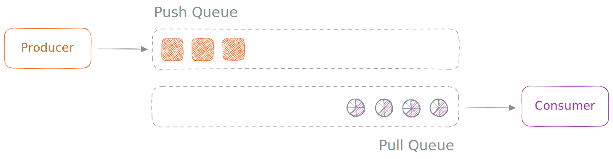

# Dune - The Stream Guide

Hi again! 🖖 You've discovered the technical overview detailing how Dune incorporates the concept of streams. This README is crafted to help you understand how streams operate in Dune, along with the reasoning behind specific technical choices.

> Streams, a way to **read** and **write** data in **chunks**.

### Philosophy

Streams serve as a crucial abstraction for handling binary data without the need to load it entirely into memory simultaneously. They find frequent application in tasks such as `reading and writing files`, managing `network requests`, and handling substantial `data processing`.

In Dune, building streams is done differently compared to Node.js. It heavily relies on JavaScript ideas like [Async Iterators](https://developer.mozilla.org/en-US/docs/Web/JavaScript/Reference/Global_Objects/AsyncIterator) and [Async Generators](https://developer.mozilla.org/en-US/docs/Web/JavaScript/Reference/Global_Objects/AsyncGenerator). This approach aims to effectively handle the flow of data that happens asynchronously.

Stephen Belanger's conference talk, [Async Iterators: A New Future for Streams](https://www.youtube.com/watch?v=YVdw1MDHVZs), is a great resource for grasping the basic principles behind the construction of Dune streams.

#### `Push Systems`

In a `push-based` system, a type of stream, events are collected and sent to the subscribed `consumer`. In this scenario, the source supplies the subscriber with data and its corresponding updates.

A primary example illustrating this system is the `EventEmitter`:

```js
import { EventEmitter } from 'events';

const stream = new EventEmitter();

stream.on('data', (data) => console.log(data));

stream.emit('data', 1);
stream.emit('data', 2);
stream.emit('data', 3);
```

This process is referred to as `push-based` because the `source` (or `producer`) actively **"pushes"** data down to consumers at its own pace. It doesn't take into account whether the producer can keep up with the speed at which data is sent, leading to the need for additional `back-pressure` mechanisms. This is why `EventEmitters` are not considered genuine streams.

In the field of web development, another widely acknowledged push-based system is the reactive extensions library, [RxJS](https://rxjs.dev/). Here, an `Observer` consumes values <ins>**delivered**</ins> by an `Observable` (producer) over a certain period.

#### `Pull Systems`

On the flip side, a `pull-based` system waits for a request before delivering data to the `consumer` (or subscriber). This is the traditional scenario where the data source is **"polled"** for more information, and these systems are tailored for applications that can pause while fetching data.

A key example illustrating this system is an `Iterator`:

```js
function* makeIterator() {
  yield 1;
  yield 2;
  yield 3;
}

const iter = makeIterator();

console.log(iter.next().value); // '1'
console.log(iter.next().value); // '2'
console.log(iter.next().value); // '3'
```

In this case, the consumer decides when to fetch the next value from the `source` (or producer). While this resolves the `back-pressure` issue linked to the push-based model, where the consumer sets the pace of data consumption, it introduces a different challenge. This approach is effective only for streams where <ins>we have control over the source</ins> (to pull the next `chunk` of data).

In the previous example, we utilized a `generator` to create the `iterator`, allowing us to manage the data pulling process.

Dune follows the second pattern, which is the `pull-based` model. This choice is practical because JavaScript provides all the necessary structures for pull-based `asynchronous` data pipelines, aligning with the core concept of Dune streams. Towards the end of this document, we will delve into how Dune constructs streams with uncontrollable sources.

### Stream Types

Dune streams offer a streamlined capability for handling data chunks `asynchronously`, particularly in scenarios involving large datasets. The four types of streams in Dune are `Readable` streams, `Writable` streams, `Duplex` streams, and `Transform` streams.

In the upcoming section, we will explore each of these stream types in more depth.

#### `Readable`

These streams are used to read data from a source, such as a file or network connection. Dune aims to keep `Readable` streams simple and assumes that any async `iterator` can serve as a readable stream. To be precise, any object that implements the async iterator protocol, indicated by [@@asyncIterator](https://developer.mozilla.org/en-US/docs/Web/JavaScript/Reference/Global_Objects/Symbol/asyncIterator), qualifies as a readable stream.

> Learn more about the iteration protocols [here](https://developer.mozilla.org/en-US/docs/Web/JavaScript/Reference/Iteration_protocols#the_async_iterator_and_async_iterable_protocols).

When developing custom readable streams, it is common to create functions that yield a stream. The easiest way to accomplish this in JavaScript is by using an async `generator` function.

```js
function timeout(ms) {
  return new Promise((resolve) => {
    setTimeout(resolve, ms);
  });
}

async function* interval(ms) {
  while (true) {
    await timeout(ms);
    yield Date.now();
  }
}

for await (const time of interval(1000)) {
  console.log(time);
}
```

This approach offers the advantage that there's no need to learn a separate API for consuming the stream. You can effortlessly use a `for-of` await loop to consume the iterator, capitalizing on the familiarity of JavaScript.

> It's crucial to recognize that Dune streams are designed for asynchronous data flows, requiring the use of async iterators and async generators. Nonetheless, it is feasible to encapsulate a basic iterator within an async one, thereby transforming it into a stream.

#### `Writable`

Writable streams are employed for writing data to a destination, such as a `file` or `network` connection. Dune streamlines writable streams by assuming that any object with both a `write()` and an `end()` function can serve as a writable stream.

While making these functions asynchronous is not mandatory, it is regarded as good practice since they will be internally invoked with `await`.

```js
const sink = {
  write: async (data) => console.log(data),
  end: async () => {},
};

sink.write('Hello');
sink.write('World!');
sink.end();
```

The above represents the simplest writable stream we can create, essentially encapsulating `console.log` within a stream. Now, let's delve into a more complex example that incorporates the `fs` module.

```js
import fs from 'fs';

async function createFileStream(filename) {
  const file = await fs.open(filename, 'w');
  return {
    async write(data) {
      await file.write(data);
    },
    async end() {
      await file.close();
    },
  };
}

const stream = createFileStream();

await stream.write('a');
await stream.write('b');
await stream.write('c');

await stream.end();
```

#### `Duplex`

Duplex streams are streams that facilitate both `reading` and `writing` of data, essentially combining the characteristics of `Readable` and `Writable` streams. They are commonly used in network communication and other scenarios where both reading and writing are essential.

Technically, an object that adheres to the `@@asyncIterator` protocol and includes both a `write()` and `end()` function is considered a Duplex stream by Dune. A classic example is the [Socket](https://github.com/aalykiot/dune/blob/main/src/js/net.js#L148) class in the net module.

#### `Transform`

Transform streams, unlike in Node.js, are a distinct type of `Readable` stream. They allow for the modification of data as it passes through the stream. Transform streams are particularly useful for tasks such as compression, encryption, or data manipulation.

Because direct writing to a transform stream is not feasible, the recommended approach for their usage is to create a custom, slightly modified `Readable` stream again using `generators` (ah shit, here we go again) and pass an iterator—pointing to the stream from which data needs to be pulled for transformation—as a parameter. This means that we can consume that iterator, transform the value, and `yield` it to the next one in the `chain`.

This allows for a convenient `composition` of streams, although it can become a bit tedious. To address this, Dune provides a `pipeline` method within the `stream` module that simplifies the procedure and facilitates the creation of elegant chains (more on that later).

While it might sound a bit complex in theory, in practice, it's quite manageable :)

```js
async function* letters() {
  yield 'a';
  yield 'b';
  yield 'c';
}

async function* toUpperCase(iterator) {
  for await (const value of iterator) {
    yield value.toUpperCase();
  }
}

for await (const letter of toUpperCase(letters())) {
  console.log(letter); // A .. B .. C
}
```

> An important note is that the entire chain and processing of the stream are `lazy`. This means that the process will only initiate when the last stream, typically a writable one, requests some data.

### Stream Pipelines

As emphasized in the previous section, composing streams is highly convenient, and that's precisely why Dune introduces the `pipeline` method. This method streamlines chaining by internally passing iterators to the next generator function in the chain and, most importantly, manages errors across the entire stream chain.

```js
import { pipeline } from 'stream';

async function* letters() {
  yield 'a';
  yield 'b';
  yield 'c';
}

async function* toUpperCase(iterator) {
  for await (const value of iterator) {
    yield value.toUpperCase();
  }
}

await pipeline(letters, toUpperCase, process.stdout);
```

> It's essential to note that the last stream provided to the `pipeline` method must always be a writable stream.

#### `uncaughtStreamException`

Most importantly, the `pipeline` method includes a mechanism to <ins>notify</ins> the streams in the chain when something has gone wrong. It signals that the pipeline is broken, and the streams should initiate cleanup procedures.

During the construction of the chain, the pipeline method generates a special `event-emitter` and provides it as an argument to all the `Readable` and `Transform` streams. These streams can then listen for the `uncaughtStreamException` event fired by the pipeline internals if an issue arises during the data processing.

```js
async function* makeStream(signal) {
  // A way to gracefully terminate the current stream.
  signal.on('uncaughtStreamException', () => {
    console.log('Ohh no, something went wrong :(');
  });

  yield 'a';
  yield 'b';
  yield 'c';
}
```

> For `transform` streams, this `event-emitter` will be the second parameter, with the first one always reserved for the iterator of the preceding stream.

### Uncontrollable Sources

Lastly, as mentioned earlier, a pull-based stream works effectively when we can control the source. However, there are cases where we can't control the source, which is not uncommon, especially in networking scenarios. Take a `TCP client`, for example.

To tackle this issue, every internal Dune object, such as `net.Socket` or `http.Server`, that satisfies the `Readable` interface utilizes a double queue mechanism.

<br />


#### `Push Queue`

This queue is used to store data received from the producer, effectively `buffering` the data until a consumer processing the stream requests the next chunk. If a new data chunk is received from the producer and the `pull-queue` is not empty, the data is promptly pushed to the consumer.

> When we mention pushing to the consumer, it simply means resolving the `promise` that we have stored in the `pull-queue`.

#### `Pull Queue`

This queue is utilized to store `pending promises` from the consumer. When a consumer requests the next chunk but it's not available yet (push-queue is empty), a `reference` of the returned promise is enqueued. Once the next chunk becomes available, we resolve that promise with the new data.

> Essentially, to address the uncontrollable source issue, we buffer both `data` and `promises` and ensure that the two queues remain in `sync`.
