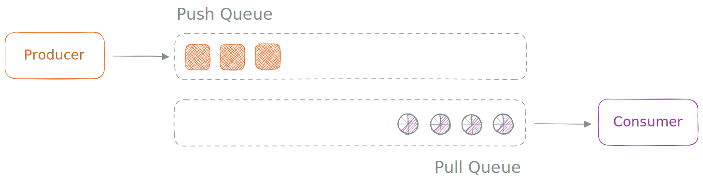

# Dune - The Stream Interface

Hi again! 🖖 You've discovered the technical overview detailing how Dune incorporates the concept of streams. This README is designed to assist you in comprehending how streams function in Dune, along with the rationale behind certain technical choices.

> Stream, a way to **read** and **write** data in **chunks**.

### Philosophy

Streams serve as a crucial abstraction for handling binary data without the need to load it entirely into memory simultaneously. They find frequent application in tasks such as `reading and writing files`, managing `network requests`, and handling substantial `data processing`.

In Dune, the construction of streams differs from that in Node.js, placing a significant reliance on JavaScript concepts such as [Async Iterators](https://developer.mozilla.org/en-US/docs/Web/JavaScript/Reference/Global_Objects/AsyncIterator) and [Async Generators](https://developer.mozilla.org/en-US/docs/Web/JavaScript/Reference/Global_Objects/AsyncGenerator). This design is intended to proficiently manage asynchronous data flows.

The conference talk titled ["Async Iterators: A New Future for Streams"](https://www.youtube.com/watch?v=YVdw1MDHVZs) by Stephen Belanger serves as an ideal resource for understanding the fundamental principles upon which Dune streams were constructed.

#### `Push Systems`

In a `push-based` system, which is akin to a stream, events are gathered and pushed to the subscribed `consumer`. In this scenario, the source provides the subscriber with data and its corresponding updates.

A primary example illustrating this system is the `EventEmitter`:

```js
import { EventEmitter } from 'events';

const stream = new EventEmitter();

stream.on('data', (date) => {
  console.log(date.toISOString());
});

stream.emit('data', new Date());
stream.emit('data', new Date());
stream.emit('data', new Date());
```

This flow is termed `push-based` because the `source` (or `producer`) actively **"pushes"** data down to consumers at its own pace. It doesn't consider whether the producer can keep up with the speed at which data is sent, necessitating the implementation of additional `back-pressure` mechanisms. This is why `EventEmitters` are not regarded as true streams.

Another commonly recognized push-based system in the web development domain is the reactive extensions library, [RxJS](https://rxjs.dev/), where an `Observer` consumes values <ins>**delivered**</ins> by an `Observable` (producer) over a certain period.

#### `Pull Systems`

Conversely, a pull-based system waits for a demand before pushing the data streams to the `consumer` (or `subscriber`). This is the classic scenario where the data source is "polled" for more information, and these systems are designed for applications that can block while pulling data.

A primary example illustrating this system is an `Iterator`:

```js
function* makeIterator() {
  yield 1;
  yield 2;
}

const iter = makeIterator();

console.log(iter.next().value); // '1'
console.log(iter.next().value); // '2'
```

In this scenario, the consumer determines when to pull the next value from the `source` (or `producer`). While this alleviates the `back-pressure` issue associated with the push-based model (where the consumer dictates the data consumption pace), it introduces a different challenge. This approach is effective only for streams where <ins>we have control over the source</ins> (to pull the next `chunk` of data).

In the previous example, we employed a `generator` to produce the `iterator`, enabling us to manage the data pulling process.

Dune adopts the second pattern, which is the `pull-based` model. This choice is convenient because JavaScript provides all the necessary structures for pull-based `asynchronous data pipelines`, aligning with the essence of Dune streams. Towards the conclusion of this document, we will explore how Dune constructs streams with uncontrollable sources.

### Stream Types

Dune streams are a concise feature that facilitates the management of data chunks `asynchronously`, especially when dealing with large datasets. The four stream types are `Readable` streams, `Writable` streams, `Duplex` streams, and `Transform` streams.

In this section, we will delve into each of these stream types in greater detail.

#### `Readable`

These streams are employed for reading data from a source, such as a file or network connection. Dune strives to keep `Readable` streams straightforward and assumes that every `async iterator` can function as a readable stream. To be more specific, any object that implements the async iterator protocol, denoted by [@@asyncIterator](https://developer.mozilla.org/en-US/docs/Web/JavaScript/Reference/Global_Objects/Symbol/asyncIterator), qualifies as a readable stream in Dune.

> Learn more about the iteration protocols [here](https://developer.mozilla.org/en-US/docs/Web/JavaScript/Reference/Iteration_protocols#the_async_iterator_and_async_iterable_protocols).

When creating custom readable streams, it is customary to craft functions that yield a stream. The simplest method to achieve this in JavaScript is by using an async `generator` function.

```js
async function* createSequenceStream(start, end) {
  for (let i = start; i <= end; i++) {
    // Wow, can use await!
    yield await new Promise((resolve) => {
      setTimeout(resolve, 1000);
    });
  }
}

let stream = createSequenceStream(1, 5);

for await (const value of stream) {
  console.log(value); // 1, then 2, then 3, then 4, then 5 (with delay between).
}
```

The benefit of this approach is that there's no need to learn a separate API for consuming the stream; you can simply use a `for-of` await loop to consume the iterator, leveraging the familiarity of JavaScript.

> It's important to note that Dune streams are tailored for asynchronous data flows, necessitating the use of async iterators and async generators. However, it is possible to encapsulate a basic iterator within an async one, transforming it into a stream.

#### `Writable`

Writable streams serve the purpose of writing data to a destination, such as a `file` or `network` connection. Dune simplifies writable streams by presuming that any object with both a `write()` and an `end()` function can function as a writable stream.

While making these functions asynchronous is not mandatory, it is considered good practice, as they will be internally invoked with `await`.

```js
const sink = {
  write: async (data) => console.log(data),
  end: async () => {},
};

sink.write('Hello');
sink.write('World!');
sink.end();
```

The above is the simplest writable stream we can create, essentially encapsulating `console.log` within a stream. Now, let's explore a more intricate example that incorporates the `fs` module.

```js
import fs from 'fs';

/**
 * This custom stream essentially acts as a wrapper around a file handle.
 */
async function createFileStream(filename) {
  const file = await fs.open(filename, 'w');
  return {
    // Writes data to the destination.
    async write(data) {
      await file.write(data);
    },
    // Performs resource cleanup.
    async end() {
      await file.close();
    },
  };
}

const stream = createFileStream();

await stream.write('a');
await stream.write('b');
await stream.write('c');

await stream.end();
```

#### `Duplex`

Duplex streams are streams that facilitate both `reading` and `writing` of data. Essentially, they combine the characteristics of `Readable` and `Writable` streams. Duplex streams find frequent use in network communication and other scenarios where both reading and writing are essential.

From a technical standpoint, an object that adheres to the `@@asyncIterator` protocol and incorporates both a `write()` and `end()` functions is regarded as a Duplex stream by Dune. A classic example is the [Socket](https://github.com/aalykiot/dune/blob/main/src/js/net.js#L148) class in the `net` module.

#### `Transform`

Transform streams, in contrast to Node.js, are a distinct type of `Readable` stream. They enable the modification of data as it traverses through the stream. Transform streams are well-suited for tasks like compression, encryption, or data manipulation.

Given that direct writing to a transform stream is not possible, the preferred method for their utilization is to create a custom, slightly different `Readable` stream once more through `generators` (ah shit, here we go again) and pass an iterator, referring to the stream from which data needs to be pulled for transformation, as an argument. This implies that we can consume that iterator (aka stream), transform the value, and `yield` it to the next one in the `chain`.

This enables a convenient `composition` of streams, but it can become quite tedious. For this reason, Dune offers a `pipeline` method within the `stream` module that simplifies the procedure and enables the creation of elegant chains (more on that later).

It might sound a bit complex, but in practice, it's quite manageable :)

```js
async function* values$() {
  yield 'a';
  yield 'b';
  yield 'c';
}

async function* toUpperCase$(iterator) {
  for await (const value of iterator) {
    yield value.toUpperCase();
  }
}

const transform = toUpperCase$(values$());

for await (const value of transform) {
  console.log(value); // A .. B .. C
}
```

> An important point to note is that the entire chain and processing of the stream are `lazy`. This implies that the process will initiate only when the last stream, typically a writable one, requests some data.

### Stream Pipelines

As highlighted in the previous section, composing streams is quite convenient, and that's precisely why Dune introduces the `pipeline` method. This method streamlines chaining by internally passing iterators to the next generator function in the chain and, most importantly, handles errors across the entire stream chain.

```js
import { pipeline } from 'stream';

async function* values$() {
  yield 'a';
  yield 'b';
  yield 'c';
}

async function* toUpperCase$(source) {
  for await (const value of source) {
    yield value.toUpperCase();
  }
}

let sentence = '';
const sink$ = {
  write: (data) => (sentence += `${data}`),
  end: () => {},
};

await pipeline(values$, toUpperCase$, sink$);

console.log(sentence);
```

> It's essential to note that the last stream provided to the `pipeline` method must always be a writable stream.

#### `uncaughtStreamException`

Most importantly, the `pipeline` method incorporates a mechanism to <ins>notify</ins> the streams in the chain when something has gone wrong. It signals that the pipeline is broken, and the stream should initiate cleanup procedures.

When constructing the chain, the pipeline method creates a special `event-emitter` and passes it as an argument to all the `Readable` and `Transform` streams. These streams can then listen for the `uncaughtStreamException` event fired by the pipeline internals if an issue occurs during the data processing.

```js
async function* makeStream(signal) {
  // A way to gracefully terminate the stream.
  signal.on('uncaughtStreamException', () => {
    console.log('Ohh, something went wrong :(');
  });

  yield 'a';
  yield 'b';
  yield 'c';
}
```

> For `transform` streams, this `event-emitter` will be the second parameter, as the first one is always reserved for the iterator of the preceding stream.

### Uncontrollable Sources

Lastly, as mentioned earlier, a pull-based stream functions well when we can control the source. However, there are cases where we can't control the source, which is not uncommon, especially in networking scenarios. Consider a `TCP client`, for example.

To address this issue, every internal Dune object such as `net.Socket` or `http.Server` that satisfies the `Readable` interface employs a double queue mechanism.

<br />


#### `Push Queue`

This queue is employed to store data received from the producer, effectively `buffering` the data until a consumer processing the stream requests the next chunk. If a new data chunk is received from the producer and the `pull-queue` is not empty, the data is promptly pushed to the consumer.

> When we refer to pushing to the consumer, it simply means fulfilling the `promise` that we have maintained in the `pull-queue`.

#### `Pull Queue`

This queue is employed to store `pending promises` from the consumer. When a consumer requests the next chunk but it's not available yet (push-queue is empty), a `copy` of the returned promise is enqueued. Once the next chunk becomes available, we resolve that promise with the new data.

> Essentially, to address the uncontrollable source issue, we buffer both `data` and `promises` and ensure that the two queues remain in `sync`.
